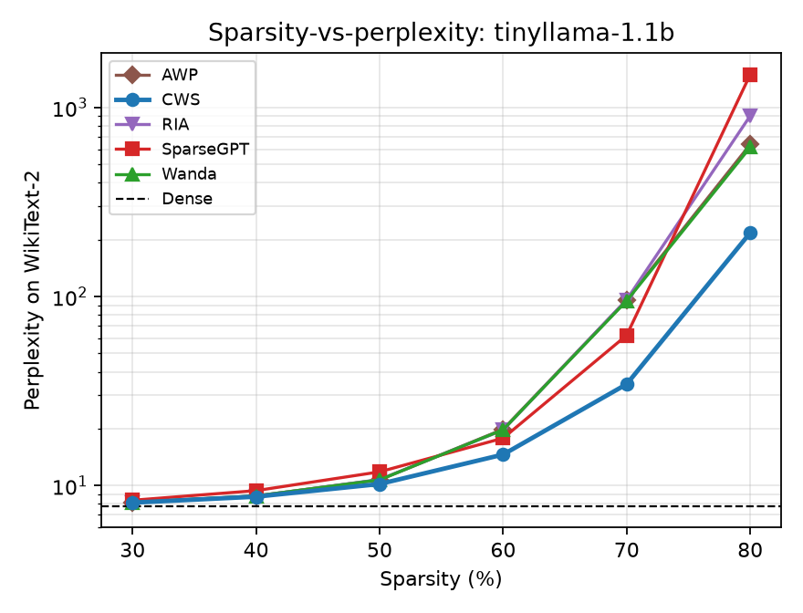
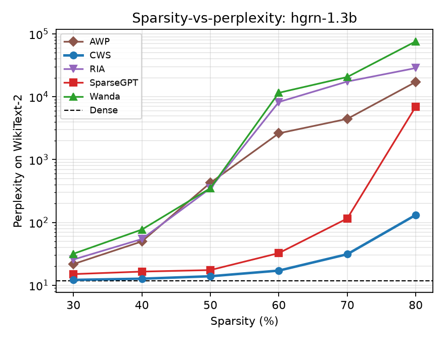
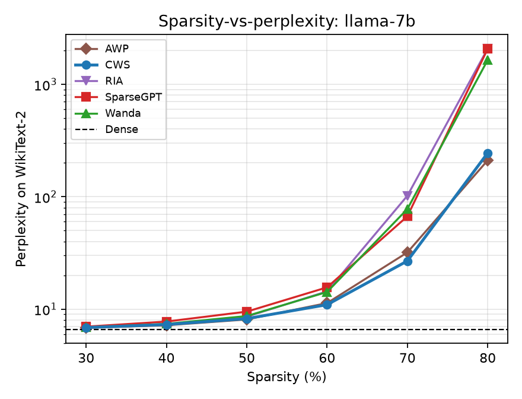

# Correlation-aware Weight Sparsity (CWS)

CWS is a post-training, one-shot LLM pruning method that extends
[SparseGPT](https://arxiv.org/abs/2301.00774)'s Optimal Brain Surgeon (OBS)
weight correction with a **full-Hessian selection criterion**. Standard
per-weight saliency scores (Magnitude, Wanda, RIA, SparseGPT's own diagonal
score) treat each weight in isolation and are blind to *cancellation
groups*: pairs (or larger groups) of correlated input channels whose
opposite-sign weights partially cancel in the layer output, so their joint
removal cost is lower than either weight's individual score predicts. CWS
derives its selection criterion from the full activation covariance instead
of its diagonal, and applies exact OBS corrections after every selection
step — pruning and correcting one layer at a time, sequentially through the
network, so each layer's calibration reflects the already-pruned output of
every prior layer.

The method and its evaluation are described in `CWS.pdf` (submitted to
NeurIPS 2026); `SparseGPT.pdf` is the baseline method it builds on.

## What's in this repo

- **`cws/cws_obs.py`** — the core CWS kernel: per-row greedy `r_j²/d_j`
  selection over an evolving local inverse-Hessian block, with exact
  Schur-complement OBS corrections. This is the method itself.
- **`cws/hessian.py`** — calibration-time `H = (2/N) XᵀX` accumulation via
  forward hooks, plus the damped Cholesky `Hinv` construction CWS/SparseGPT
  share.
- **`cws/baselines.py`** — Magnitude, Wanda, and a from-scratch SparseGPT
  reimplementation (shared, non-per-row `Hinv`), for comparison against CWS.
  RIA and AWP are cited in the paper but are **not implemented here** (see
  [Limitations](#limitations)).
- **`cws/models/`** — architecture-agnostic block discovery: finds a causal
  LM's ordered list of transformer/SSM blocks and every `nn.Linear` inside
  each, so the same driver runs over LLaMA-family transformers and FLA's
  gated-recurrent HGRN without architecture-specific glue code.
- **`cws/sequential.py`** — the layer-by-layer driver: for each block in
  order, calibrate on the (already-pruned) output of every prior block,
  prune + correct every Linear in the block, then re-run the block so the
  next block calibrates against real sparsified activations.
- **`cws/data.py`** — C4 calibration sampling and WikiText-2 test-set
  chunking, matching the paper's protocol (64 batches, batch size 4,
  seqlen 512; non-overlapping 2048-token PPL chunks).
- **`cws/eval_ppl.py`**, **`cws/eval_tasks.py`** — WikiText-2 perplexity and
  a zero-shot `lm-evaluation-harness` wrapper (ARC-Easy, ARC-Challenge,
  HellaSwag, PIQA, WinoGrande, LAMBADA).
- **`cws/plotting.py`** — PPL-vs-sparsity plotting utility (see
  [PPL comparison plots](#ppl-comparison-plots)).
- **`scripts/prune.py`** — one-shot CLI: load a model, prune it, evaluate
  PPL (and optionally the full benchmark suite).
- **`scripts/run_sparsity_sweep.py`** — sweeps sparsity 30%–80% across
  models/methods and writes a PPL-vs-sparsity CSV.
- **`scripts/run_full_benchmark.py`** — runs the full zero-shot benchmark
  suite at 50% and 80% sparsity.
- **`tests/`** — a numerical check that CWS's correlation-aware selection
  reconstructs a correlated layer's output at least as well as uncorrected
  magnitude pruning, and a wiring smoke test that runs every method
  end-to-end on a tiny randomly-initialized model (no downloads required).

## Models

| short name       | HF hub id                                      | architecture                     |
|-------------------|------------------------------------------------|-----------------------------------|
| `tinyllama-1.1b`  | `TinyLlama/TinyLlama-1.1B-intermediate-step-1431k-3T` | LLaMA-family transformer     |
| `llama-7b`        | `openlm-research/open_llama_7b`                | LLaMA-family transformer         |
| `hgrn-1.3b`       | `fla-hub/hgrn-1.3B-100B`                        | gated-recurrent SSM, no attention |

Any other HF hub id or local path also works by passing it directly to
`--model` — the registry above is just a convenience alias.

`hgrn-1.3b` requires the
[`flash-linear-attention`](https://github.com/fla-org/flash-linear-attention)
package (`pip install flash-linear-attention`) to register its architecture
with `transformers.AutoModelForCausalLM`.

## Installation

```bash
pip install -r requirements.txt
# only needed for HGRN-1.3B:
pip install flash-linear-attention
```

A CUDA GPU is strongly recommended for `llama-7b` and for running the full
sparsity sweep + benchmark suite across all three models — see
[Hardware](#hardware-notes) below.

## Usage

Single pruning + PPL run:

```bash
python scripts/prune.py --model tinyllama-1.1b --method cws --sparsity 0.5 --device cuda
```

Add `--benchmark` for the zero-shot task suite, `--full-tasks` to include
LAMBADA, `--save-model DIR` to persist the pruned checkpoint:

```bash
python scripts/prune.py --model hgrn-1.3b --method cws --sparsity 0.8 \
    --device cuda --benchmark --full-tasks --out results/hgrn_80.json
```

Sparsity sweep (30%–80%), PPL only:

```bash
python scripts/run_sparsity_sweep.py \
    --models tinyllama-1.1b hgrn-1.3b llama-7b \
    --methods cws sparsegpt wanda magnitude \
    --device cuda --out results/sweep.csv
```

Full benchmark at 50%/80% sparsity:

```bash
python scripts/run_full_benchmark.py \
    --models tinyllama-1.1b hgrn-1.3b llama-7b \
    --methods cws sparsegpt wanda magnitude \
    --device cuda --include-dense --out results/benchmark.json
```

`--blocksize 0` switches CWS to the paper's "global" ablation (the whole
layer as one block, `blocksize=None` in `cws_prune_layer`) — numerically
stable on the 1B-parameter model but prone to Cholesky failures on wider
layers (LLaMA-7B, HGRN-1.3B), which is why the paper defaults to `B=128`.

## PPL comparison plots

`cws/plotting.py` renders sparsity-vs-perplexity plots (log-scale PPL,
one line per method, dense baseline as a dashed reference) from any sweep
CSV shaped like `[model, method, sparsity, wikitext2_ppl]`. Pass `--plot`
to `run_sparsity_sweep.py` to generate one figure per model automatically
once you run the sweep on your own hardware:

```bash
python scripts/run_sparsity_sweep.py --models tinyllama-1.1b hgrn-1.3b llama-7b \
    --methods cws sparsegpt wanda magnitude --device cuda \
    --out results/sweep.csv --plot --plot-dir results/figures
```

No live sweep has been run in this environment yet (no GPU here, see
[Hardware](#hardware-notes)). In the meantime, `results/paper_reported_sweep.csv`
holds the exact 30-80% sweep numbers CWS.pdf reports for CWS, Wanda, RIA,
SparseGPT, and AWP (Tables 3, 6, and 10, cross-checked against the PDF's
text layer, not OCR), and `results/figures/paper_reported/*.png` are that
data plotted with the same `plot_sweep_csv` utility — i.e. a reproduction
of the paper's Figures 1-3, not a measurement taken by this codebase:

| TinyLlama-1.1B | HGRN-1.3B | LLaMA-7B |
|---|---|---|
|  |  |  |

Note RIA and AWP appear in these paper-sourced plots even though
`cws/baselines.py` doesn't implement them (see [Limitations](#limitations))
— once real sweeps are run through this pipeline, `results/sweep.csv` will
only have rows for whichever `--methods` you actually pass.

## Method summary

For output row `i` and pruned index set `S`, the reconstruction objective is

```
min_{S, |S|=k}  E_x[(w_i^T x - (M_i ⊙ w_i)^T x)^2] = w_{i,S}^T Σ_X[S,S] w_{i,S}
```

where `Σ_X = E[xx^T]` is the full input activation covariance. Diagonal
scoring methods implicitly assume `Σ_X` is diagonal; CWS instead solves this
combinatorial selection problem greedily, picking the weight `j` minimizing
the marginal cost `δ(j | S') = r_j² / d_j`, where `r_j` and `d_j` are the
`j`-th residual and diagonal entry of the *evolving* Cholesky factor of
`H⁻¹` (updated via a rank-1 Schur downdate after each pick). Because each
output row can choose a different elimination order, CWS keeps a private
local inverse-Hessian copy per row within each column block (`B=128` by
default), rather than reusing one shared elimination sequence for every row
the way SparseGPT does. See `CWS.pdf` Sec. 2 for the full derivation,
including the block-boundary lazy-update formula used to propagate a
block's correction to not-yet-pruned columns.

## Hardware notes

This was developed and smoke-tested on an Apple Silicon Mac with no GPU;
`torch`/`transformers` are not preinstalled system-wide, and the pruning
kernel follows SparseGPT's convention of falling back to `float32` on MPS
(no `float64` support) instead of the `float64` used on CPU/CUDA. Running
the actual sparsity sweep and full benchmark suite across all three models
— especially LLaMA-7B — requires a CUDA GPU with enough memory to hold the
dense checkpoint plus its per-layer Hessians; this was not run end-to-end
in this environment. The unit and smoke tests under `tests/` validate the
kernel's numerics and the sequential driver's wiring without requiring any
model download.

## Limitations

- **RIA and AWP baselines are not implemented.** The paper compares CWS
  against Wanda, RIA, SparseGPT, and AWP; this repo implements Magnitude,
  Wanda, and SparseGPT faithfully but omits RIA (Zhang et al., 2024) and AWP
  (Liu et al., 2025) rather than risk a subtly incorrect reimplementation.
- **CPU inference benchmarks (AVX-512 sparse kernels, Section 4/Table 12 of
  the paper) are not included.** This repo covers the pruning method and
  its accuracy evaluation only.
- Model hub ids above are best-effort aliases for the checkpoints named in
  the paper; if a tag has moved, pass the correct HF hub id directly via
  `--model`.

## Citation

```bibtex
@inproceedings{cws2026,
  title     = {Semi-Structured Correlation-aware Weight Sparsity (CWS) for Efficient LLM Inference},
  booktitle = {Submitted to the 40th Conference on Neural Information Processing Systems (NeurIPS 2026)},
  year      = {2026},
  note      = {Under review}
}

@inproceedings{frantar2023sparsegpt,
  title     = {SparseGPT: Massive Language Models Can Be Accurately Pruned in One-Shot},
  author    = {Frantar, Elias and Alistarh, Dan},
  booktitle = {International Conference on Machine Learning},
  pages     = {10323--10337},
  year      = {2023}
}
```

## License

MIT — see `LICENSE`.
